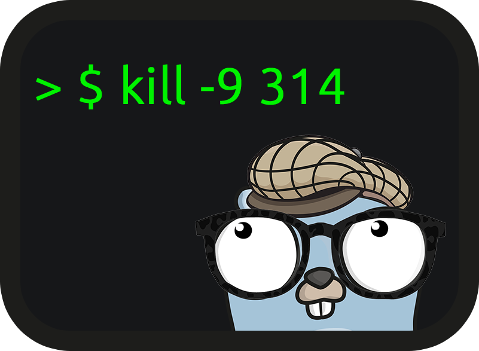

[](https://travis-ci.com/gol4ng/signal)
[](https://codeclimate.com/github/gol4ng/signal/maintainability)
[](https://codeclimate.com/github/gol4ng/signal/test_coverage)
[](https://goreportcard.com/report/github.com/gol4ng/signal)

# signal
This repository provides helpers with POSIX [signal(7)](http://man7.org/linux/man-pages/man7/signal.7.html)

## Installation

`go get -u github.com/gol4ng/signal`

## Quick Start

## Subscriber
Signal subscriber that allows you to attach a callback to an `os.Signal` notification.

Useful to react to any os.Signal.

It returns an `unsubscribe` function that can gracefully stop some http server and clean allocated object

> :warning: If you defer unsubcribe dont forget the final `()`, If you forget it go defer will execute the subscribe process

> defer signal.Subscribe(func(){}, signals...)**()**

```go
package main

import (
	"fmt"
	"os"
	"syscall"
	"time"

	"github.com/gol4ng/signal"
)

func main() {
	defer signal.Subscribe(func(signal os.Signal) {
		fmt.Println("this code is execute when signal os.Interrupt, os.Kill was received")
	}, os.Interrupt, syscall.SIGTERM)()

    // your application code here
}
```

## With killer

The killer subscriber will register your signal handler, 
but it register another one that gonna to kill (`os.Exit`) application if 2 [killer signals](killer_subscriber.go#L9) was received.

```go
package main

import (
	"fmt"
	"os"
	"time"
	"syscall"

	"github.com/gol4ng/signal"
)

func main() {
    defer signal.SubscribeWithKiller(func(signal os.Signal) {
      // here you can implement your application stopping steps
		fmt.Println("this code is execute when signal os.Interrupt, syscall.SIGTERM was received")
    }, os.Interrupt, syscall.SIGTERM)()

    // your application code here
}
```
